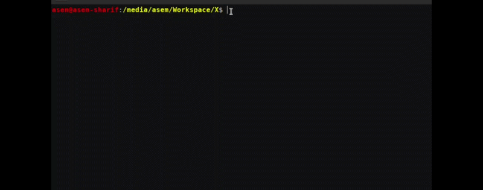
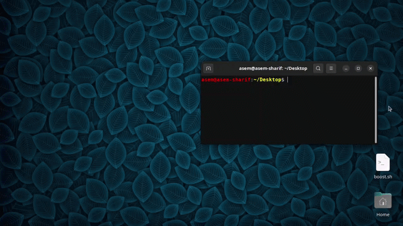

<div align="center">

<br>

```
██╗   ██╗████████╗ ███████╗███████╗████████╗ ██████╗██╗  ██╗███████╗██████╗   ██████╗ ██╗     ██╗   ██╗███████╗
╚██╗ ██╔╝╚══██╔══╝ ██╔════╝██╔════╝╚══██╔══╝██╔════╝██║  ██║██╔════╝██╔══██╗  ██╔══██╗██║     ██║   ██║██╔════╝
 ╚████╔╝    ██║    █████╗  █████╗     ██║   ██║     ███████║█████╗  ██████╔╝  ██████╔╝██║     ██║   ██║███████╗
  ╚██╔╝     ██║    ██╔══╝  ██╔══╝     ██║   ██║     ██╔══██║██╔══╝  ██╔══██╗  ██╔═══╝ ██║     ██║   ██║╚════██║
   ██║      ██║    ██║     ███████╗   ██║   ╚██████╗██║  ██║███████╗██║  ██║  ██║     ███████╗╚██████╔╝███████║
   ╚═╝      ╚═╝    ╚═╝     ╚══════╝   ╚═╝    ╚═════╝╚═╝  ╚═╝╚══════╝╚═╝  ╚═╝  ╚═╝     ╚══════╝ ╚═════╝ ╚══════╝
```

#### `Zero Compromise`

---

<p align="center">
  <a href="https://python.org">
    
  </a>
  <a href="LICENSE">
    
  </a>
  
  <br>

  <a href="https://github.com/yt-dlp/yt-dlp">
    
  </a>
  <a href="https://github.com/jdepoix/youtube-transcript-api">
    
  </a>
  <br>

  <a href="https://riverbankcomputing.com/software/pyqt/">
    
  </a>
 
  <a href="https://python-pillow.org/">
    
  </a>

</p>
</div>

---

## &nbsp;&nbsp;Overview

**YTFetcherPlus** is a lightweight, high-performance native desktop application for inspecting and downloading video streams, audio tracks, and captions from YouTube and virtually any major video platform — built on `yt-dlp` with responsive `PyQt6` interface.

---

<br>

## &nbsp;&nbsp;Preview

<br>

### &nbsp;&nbsp;Setup

> Run once. Takes about 60 seconds.

<div align="center">



</div>

<br>

### &nbsp;&nbsp;Usage

> Fetch → Select → Download.

<div align="center">



</div>

<br>

---

<br>

## &nbsp;&nbsp;Features

<table>
<tr>
<td width="50%" valign="top">

**&nbsp;&nbsp;Stream Intelligence**

- Classifies all available formats into Video, Audio, Combined, and Unclassified tracks
- Displays resolution, FPS, codec, bitrate, sample rate, channels, and estimated file size per stream
- Select one video + one audio track simultaneously — auto-merged on download via `ffmpeg`

</td>
<td width="50%" valign="top">

**&nbsp;&nbsp;Caption Pipeline**

- Fetches original subtitle tracks provided by the uploader
- Fetches auto-generated and translated captions via YouTube's own engine
- Preview before saving — exported as clean `.srt` files
- Falls back to guided browser-session flow when direct extraction is restricted

</td>
</tr>
<tr>
<td width="50%" valign="top">

**&nbsp;&nbsp;Platform Coverage**

- YouTube, Facebook, Instagram, X (Twitter), and hundreds of other sites via `yt-dlp`
- URL is stripped of tracking parameters before any request is made

</td>
<td width="50%" valign="top">

**&nbsp;&nbsp;Built for Daily Use**

- Persistent download directory — set once, remembered forever
- Local session history (last 100 URLs + titles)
- Thumbnail viewer with one-click save
- Clipboard paste shortcut, open-folder shortcut, clickable status paths

</td>
</tr>
</table>

<br>

---

<br>

## &nbsp;&nbsp;Installation

<br>

### &nbsp;&nbsp;Prerequisites

| Requirement | Version |
|---|---|
| Python | `3.10` or later |
| bash | Any modern shell |
| sudo | Required for global command registration |

<br>

### &nbsp;&nbsp;Install

```bash
# 1. Clone the repository
git clone https://github.com/asem-sharif-ai/YTFetcherPlus
cd YTFetcherPlus

# 2. Run setup — only needed once
chmod +x Setup.sh
./Setup.sh
```

**What `Setup.sh` does:**

```
[1]  Creates an isolated Python virtual environment at ./env/
[2]  Installs PyQt6, yt-dlp, Pillow, youtube-transcript-api
[3]  Registers a global `ytf` command at /usr/local/bin/ytf
```

No system-wide package pollution. Everything stays inside `./env/`.

<br>

### &nbsp;&nbsp;Uninstall

```bash
sudo rm /usr/local/bin/ytf
rm -rf ./env/
```


<br>

---

<br>

## &nbsp;&nbsp;Usage

```bash
ytf                    # Launch the app
ytf "https://..."      # Launch and pre-load a URL
```

<br>

---

<br>

### &nbsp;&nbsp;Stream Tabs

| Tab | What It Shows | Selection Behavior |
|---|---|---|
| **Separated Streams** | Video-only and audio-only tracks, side by side | Select one or both — both triggers download & merge |
| **Combined Streams** | Pre-muxed video+audio formats | Single selection, single download |
| **UnClassified** | Platform-specific or unusual formats that don't map to V or A | Single selection, single download |
| **Captions** | Original and translated subtitle tracks | Language → optional translate target → preview → `.srt` |

<br>

---

<br>

### &nbsp;&nbsp;Caption Notes

Most original tracks download instantly. YouTube-translated captions sometimes require a brief browser interaction — the app opens the URL automatically and guides you through pasting the result back into the preview window.

<br>

---

<br>

## &nbsp;&nbsp;Project Structure

```
YTFetcherPlus/
│
├── App.py         ← Entry point
├── Main.py        ← Main window, layout, and all UI logic
├── Workers.py     ← Service workers
├── Widgets.py     ← Custom widgets
├── About.py       ← About window
├── Style.qss      ← Qt stylesheet
│
├── CFG.json       ← Auto-generated on first run (download path and history)
│
├── Setup.sh       ← One-time install (virtual environment, dependencies, and global command)
└── Run.sh         ← Entry point called by `ytf` and `ytf [URL]`
```

<br>

---

<br>

## &nbsp;&nbsp;Configuration

`CFG.json` is created automatically on first launch. 

```json
{
  "PATH": "~/Downloads/YTFetcherPlus",
  "HISTORY": [
    {
      "URL": "https://www.youtube.com/watch?v=...",
      "TITLE": "Video Title Here"
    }
  ]
}
```

| Key | Description |
|---|---|
| `PATH` | Default download destination. Changeable anytime via `SET DIRECTORY` in the UI. |
| `HISTORY` | Rolling log of the last 100 fetched URLs and titles. Stored locally, never transmitted. |

<br>

---

<br>

## &nbsp;&nbsp;Dependencies


| Package | Role |
|---|---|
| [`PyQt6`](https://riverbankcomputing.com/software/pyqt/) | Native desktop UI framework |
| [`yt-dlp`](https://github.com/yt-dlp/yt-dlp) | Core stream extraction and download engine |
| [`Pillow`](https://python-pillow.org/) | Thumbnail decoding and preview |
| [`youtube-transcript-api`](https://github.com/jdepoix/youtube-transcript-api) | Caption and subtitle fetching |

<br>

---

<br>

## &nbsp;&nbsp;Roadmap


| | Feature |
|---|---|
| ✓ | Multi-platform support via `yt-dlp` |
| ✓ | Separated, combined, and unclassified stream classification |
| ✓ | Video and audio independent selection with auto-merge on download |
| ✓ | Caption fetch, translate, preview, and export |
| ✓ | Persistent config and rolling session history |
| ✓ | Thumbnail save, clipboard shortcuts, clickable status paths |
| ☐ | Playlist handling — queue and batch download |
| ☐ | Page scanner — detect and list all downloadable videos on any webpage |

<br>

---

<br>

## &nbsp;&nbsp;Background

YTFetcherPlus began as a personal utility prototype: [YTFetcher](https://github.com/asem-sharif-ai/Undergraduate/tree/main/Year-3/YTFecher). Implemented to provide precise control over which stream to download without relying on browser extensions or bloated desktop clients.

This version is a complete rebuild. The threading architecture was redesigned around `QThread` workers to eliminate UI blocking. Format classification was rewritten to handle the full spectrum across platforms. Caption support was added from scratch. And a significantly more refined UI which has been restructured around a proper QSS design system.

<br>

---

## &nbsp;&nbsp;License

Released under the [MIT License](LICENSE). Use it, fork it, build on it.

---
